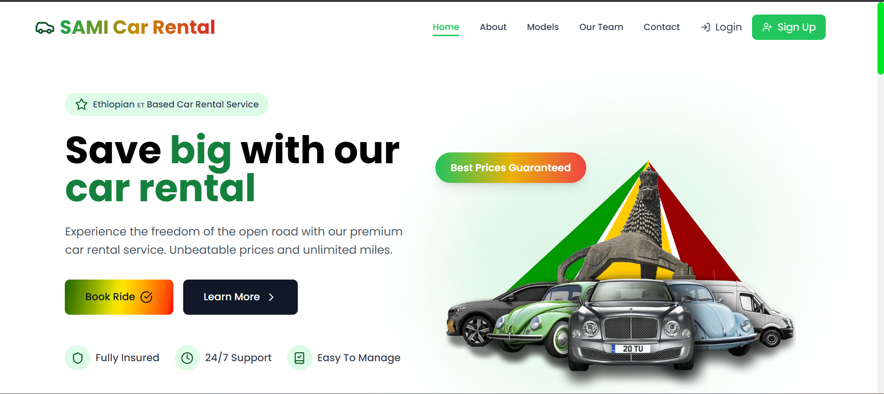

# Car Rental System



---

## Project Overview

**Car Rental System** is a full-stack web application that enables customers to browse vehicles, make reservations, and manage bookings. It includes a hierarchical role-based system with **Users**, **Admins**, and **Super Admins**. Admins manage vehicles and reservations; Super Admins manage admins and drivers, view analytics, and oversee the platform. The app supports document uploads (driver licenses, payment proofs), PDF generation for reservations, digital ID verification, and automated background jobs for reservation expiration and status updates.

---

## Tech Stack

| Layer | Technologies |
|-------|-------------|
| **Frontend** | React 18, Vite, React Router DOM 7, Tailwind CSS, Framer Motion, Lucide React, Recharts, Zustand, pdf-lib, react-day-picker, emailjs-com |
| **Backend** | Node.js, Express 5 |
| **Database** | MySQL / MariaDB |
| **Authentication** | JWT (jsonwebtoken), bcrypt |
| **File Handling** | Multer, PDFKit |
| **Validation** | Zod |

---

## Key Features

- **User Features**
  - User registration and login with JWT authentication
  - Forgot/reset password (EmailJS for reset links)
  - Browse vehicles by model, availability, and date
  - Create, update, and cancel reservations
  - Upload driver license and payment documents
  - View and manage reservations
  - Digital ID verification
  - PDF generation for reservation confirmations and history

- **Admin Features**
  - Admin login with separate JWT secret
  - Add, update, and delete vehicles (with image uploads)
  - View and manage pending/confirmed reservations
  - Confirm or reject reservations
  - View all users and user details (including documents)
  - Advanced search (type and value)

- **Super Admin Features**
  - Manage admins (create, update, delete)
  - Manage drivers (add, update, delete)
  - Analytics dashboard (reservation summary, admin activity, vehicle demand, income trends, user analysis)

- **Background Jobs**
  - Auto-delete pending reservations after a countdown (e.g., 30 minutes)
  - Daily check to auto-confirm “onHold” reservations within 7 days of pickup

---

## Project Structure

```
car-rental-v2/
├── client/                     # React frontend (Vite)
│   ├── public/
│   │   └── robots.txt
│   ├── src/
│   │   ├── components/         # Reusable components
│   │   │   ├── Auth/           # Login, Register, Forgot/Reset Password
│   │   │   ├── default/        # Navbar, Footer, Loader, ScrollButton, etc.
│   │   │   ├── home/           # Hero, Faq, Work
│   │   │   ├── printPDF/       # PDF generation for reservations
│   │   │   └── Role/           # Role-based access (RequireRole)
│   │   ├── layout/             # Route layouts
│   │   │   ├── MainLayout.jsx
│   │   │   ├── AuthLayout.jsx
│   │   │   ├── AdminLayout.jsx
│   │   │   ├── AuthAdminLayout.jsx
│   │   │   └── SuperAdminLayout.jsx
│   │   ├── Pages/              # Page components
│   │   │   ├── admin/          # Admin: Vehicles, Reservations, Users
│   │   │   ├── superAdmin/     # Super admin: Admins, Drivers, Analytics
│   │   │   ├── Home.jsx
│   │   │   ├── Models.jsx
│   │   │   ├── singleModel.jsx
│   │   │   ├── Booking.jsx
│   │   │   ├── MyReservation.jsx
│   │   │   └── ...
│   │   ├── assets/
│   │   ├── App.jsx
│   │   └── main.jsx
│   ├── index.html
│   ├── vite.config.js
│   ├── tailwind.config.js
│   └── package.json
│
├── server/                     # Express backend
│   ├── controller/             # Request handlers
│   │   ├── admin/              # Vehicle CRUD, confirm reservations, super admin
│   │   └── user/               # Auth, user info, reservations
│   ├── db/
│   │   ├── config.js           # MySQL connection pool
│   │   └── car_rental.sql      # Database schema + seed data
│   ├── middleware/             # auth.js (user JWT), adminAuth.js (admin JWT)
│   ├── router/                 # API routes
│   │   ├── admin/
│   │   ├── superadmin/
│   │   ├── user/
│   │   └── vehicle/
│   ├── service/                # Business logic
│   ├── uploads/                # Static uploads (vehicle images, documents)
│   ├── index.js
│   └── package.json
│
├── car_rental.sql              # Alternate DB dump
├── README.md
└── package-lock.json
```

---

## Installation & Setup

### Prerequisites

- Node.js (v18+ recommended)
- MySQL or MariaDB
- npm or yarn

### 1. Clone the repository

```bash
git clone <repository-url>
cd car-rental-v2
```

### 2. Database setup

Create a database named `car_rental` and import the schema:

```bash
mysql -u root -p < server/db/car_rental.sql
```

Or use `car_rental.sql` in the project root. Adjust `server/db/config.js` if your MySQL host, user, or password differ.

### 3. Backend setup

```bash
cd server
npm install
```

Create a `.env` file in the `server` folder:

```env
PORT=4000
JWT_SECRET=your-jwt-secret-for-users
JWT_ADMIN_SECRET=your-jwt-secret-for-admins
```

Start the server:

```bash
npm run dev
```

The API will run on `http://localhost:4000` by default.

### 4. Frontend setup

Open a new terminal:

```bash
cd client
npm install
npm run dev
```

The app will run at `http://localhost:5173`.

**Note:** The client currently calls `http://localhost:3000` for API requests. Either:

- Run the backend on port 3000 (`PORT=3000` in `server/.env`), or  
- Add a `VITE_API_URL` env variable and update the client to use it for API calls.

---

## Environment Variables

| Variable | Location | Description |
|----------|----------|-------------|
| `PORT` | `server/.env` | Backend port (default: 4000) |
| `JWT_SECRET` | `server/.env` | Secret for user JWT tokens |
| `JWT_ADMIN_SECRET` | `server/.env` | Secret for admin/super-admin JWT tokens |
| `VITE_API_URL` | `client/.env` | (Optional) Base URL for API (e.g. `http://localhost:4000`) |
| `VITE_EMAILJS_SERVICE_ID` | `client/.env` | (Optional) EmailJS service ID for forgot password |
| `VITE_EMAILJS_TEMPLATE_ID` | `client/.env` | (Optional) EmailJS template ID |
| `VITE_EMAILJS_PUBLIC_KEY` | `client/.env` | (Optional) EmailJS public key |

Database connection is configured in `server/db/config.js`. For production, consider using environment variables such as `DB_HOST`, `DB_USER`, `DB_PASSWORD`, and `DB_NAME`.

---

## API Overview

| Route prefix | Purpose |
|--------------|---------|
| `/api/user/*` | User auth, profile, reservations |
| `/api/auth/*` | Forgot/reset password, token check |
| `/api/admin/*` | Admin auth, vehicles, reservations, users |
| `/api/superadmin/*` | Admins, drivers, analytics |
| `/api/vehicle/*` | Vehicle listing and details |
| `/api/reservation/*` | Reservations (user and admin) |

---

## License

This project is proprietary. Use according to your organization’s policies.
